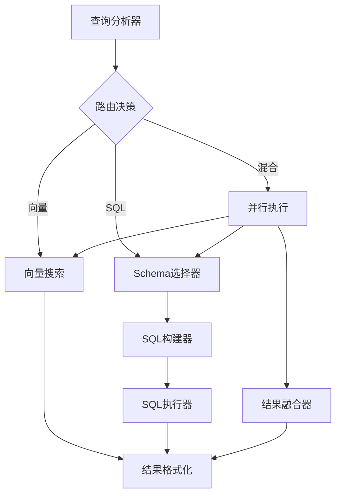

# Text2SQL Workflow 重构文档

## 概述

我们已经将原本耦合度较高的 pipeline 重构为适合 CloudFlare Workflow 的模块化架构。每个步骤都是独立的路由器，可以单独部署和调用。

## 架构对比

### 原架构（耦合版本）
```
pre-handle → pre-sql → gen-sql → run-sql
    ↓
向量搜索逻辑嵌入在 pre-handle 中
```

### 新架构（模块化版本）


## 模块说明

### 1. 查询分析器 (query-analyzer)
- **职责**：分析查询意图，决定执行策略
- **输入**：查询文本、数据库schema、向量化字段信息
- **输出**：路由决策、SQL配置、向量搜索配置

### 2. 向量搜索 (vector-search)
- **职责**：执行语义向量搜索
- **输入**：搜索配置（表、字段、查询文本）
- **输出**：相似度匹配结果

### 3. Schema选择器 (schema-selector)
- **职责**：选择相关的表和字段
- **输入**：SQL配置、完整schema、向量搜索上下文
- **输出**：精简schema、SQL提示

### 4. SQL构建器 (sql-builder)
- **职责**：生成优化的SQL语句
- **输入**：精简schema、SQL提示、向量搜索ID
- **输出**：SQL语句、查询类型

### 5. SQL执行器 (sql-executor)
- **职责**：安全执行SQL查询
- **输入**：SQL语句、查询类型、执行选项
- **输出**：查询结果、执行统计

### 6. 结果融合器 (result-fusion)
- **职责**：融合向量搜索和SQL查询结果
- **输入**：向量结果、SQL结果、融合参数
- **输出**：融合后的结果集

### 7. 工作流编排器 (workflow-orchestrator)
- **职责**：协调整个查询处理流程
- **输入**：用户查询、配置选项
- **输出**：最终结果、执行元数据

## 使用示例

### 1. 直接调用新版工作流
```typescript
const result = await trpc.workflow.execute.mutate({
  query: "查找对文档管理感兴趣的5星客户",
  databaseSchema: schemaJson,
  options: {
    maxRows: 100,
  }
});
```

### 2. 单独调用某个步骤
```typescript
// 仅执行向量搜索
const vectorResult = await trpc.vectorSearch.search.mutate({
  queries: [{
    table: "text2sql_companies",
    fields: ["remark", "mainBusiness"],
    searchText: "文档管理",
    limit: 20
  }]
});

// 仅构建SQL
const sqlResult = await trpc.sqlBuilder.build.mutate({
  query: "查找5星客户",
  slimSchema: selectedSchema,
  selectedTables: [...],
  sqlHints: {...}
});
```

## CloudFlare Workflow 部署建议

### 1. Worker 拆分
每个路由器可以部署为独立的 Worker：
- `query-analyzer-worker`
- `vector-search-worker`
- `schema-selector-worker`
- `sql-builder-worker`
- `sql-executor-worker`
- `result-fusion-worker`

### 2. Durable Objects 状态管理
```typescript
export class WorkflowState extends DurableObject {
  async fetch(request: Request) {
    // 管理工作流状态
    // 协调步骤执行
    // 处理错误和重试
  }
}
```

### 3. 并行执行优化
混合搜索模式下，向量搜索和Schema选择可以并行：
```typescript
const [vectorResult, schemaResult] = await Promise.all([
  env.VECTOR_SEARCH.fetch(vectorRequest),
  env.SCHEMA_SELECTOR.fetch(schemaRequest)
]);
```

### 4. 缓存策略
- 使用 Workers KV 缓存查询分析结果
- 使用 Cache API 缓存向量搜索结果
- SQL结果根据查询特征决定缓存策略

## 优势

1. **模块化**：每个功能独立，易于维护和测试
2. **可扩展**：可以独立扩展某个步骤的计算资源
3. **容错性**：单个步骤失败不影响其他步骤
4. **并行化**：自然支持步骤并行执行
5. **监控友好**：每个步骤都有清晰的输入输出，易于监控

## 迁移指南

旧版本接口仍然保留，可以逐步迁移：

1. 第一阶段：使用新的工作流编排器，但保持原有调用方式
2. 第二阶段：逐步替换为直接调用各个模块
3. 第三阶段：部署到 CloudFlare Workers
4. 第四阶段：完全切换到分布式架构

## 注意事项

1. 当前的 `workflow-orchestrator` 是简化版本，实际部署时需要：
   - 实现真正的步骤协调逻辑
   - 添加错误处理和重试机制
   - 实现状态持久化

2. 数据传递：
   - 步骤之间通过标准化的 Schema 传递数据
   - 大数据量考虑使用 R2 存储

3. 性能优化：
   - 合理设置并行度
   - 使用流式处理大结果集
   - 实现智能缓存策略 